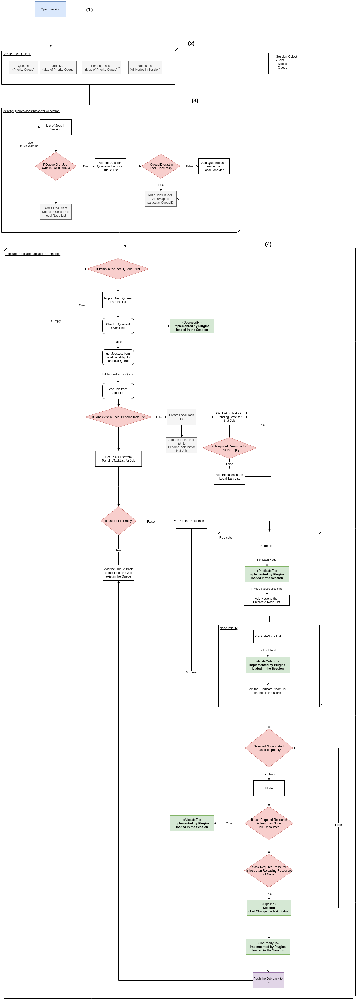

## Execution of the Scheduler for Allocating the Workloads to Node

The Allocation of the workloads to the node in Kube-batch happens in each session and the workflow of the session is illustrated in the below diagram.

1. Session Opens every 1 sec
2. In very session local copies of Queues, JobsMap, PendingTasks and Node List is created.
3. For Each Jobs in the Session
    1. If the Queued ID in the Job exists in the Local Copy of Queues then :
        1. Add the Queue in the Local Copy of Queues
            1. If the QueueID exists in local copyof JobsMap:
                1. Push the Job in the JobsMap
            2. If Not then Add the QueueID as the key in Local JobsMap and add the job in the Map.
    2. If Not then Give warning and continue to Step 3
4. For Each Item in Local Queues
    1. Pop an Queue from the Queues
        1. Check if Queue is overused
            1. If Yes then Continue to Step 4
            2. If Not then get the list of JobsList from the JobsMap for the particular Queue.
                1. If List is empty then continue to Step 4
                2. If Yes then Pop a Job from the JobsList
                    1. If Job exits the Local PendingTasks
                        1. If Not then : 
                            1. Create a Local Task List
                                1. Get the List of Each Tasks in the pending state for that job
                                    1. If the required resource for the job is Empty then go back to previous step
                                    2. If Not then Add the tasks in the Local TasksList
                            2. Add the local Tasks List to PendingTasks for that Job
                        2. If Yes then :
                            1. For each Tasks from the pendingTasksList for the Job.
                                1. Pop the tasks
                                2. Get the list of predicate nodes for the task.
                                3. Score the predicate nodes and sort it.
                                4. For each node in the sorted predicated + scored nodes
                                    1. If the Resource required by task is less than Idle resource of Nodes
                                        1. If Resource required by task is less than  releasing resource of Node
                                            1. Then Add the tasks in Pipeline
                        3. Check if Job is ready to be allocated
                            1. If yes the push the Job
                            2. If No then add the Queue back to the list.
                3. Continue till all the Job is ready
    2. Continue till each Queue is processed.      
                                            
                                       
                                 

