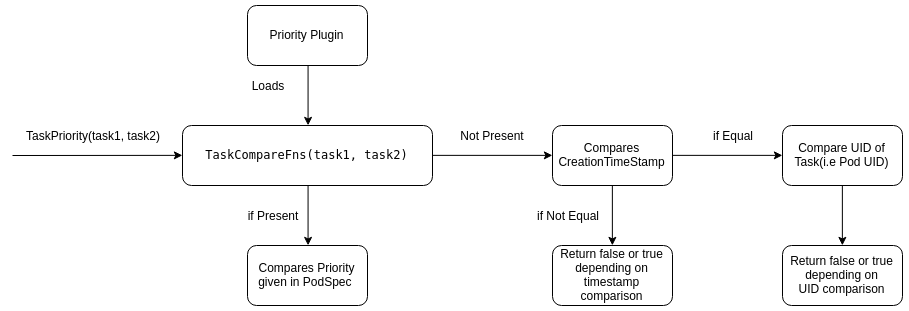

# Task Priority within Job

## Introduction

When a workload is presented to kube-batch in the form of jobs or tasks,
kube-batch prioritizes those job/tasks, so job/task with high priority is
handled first.  In this doc, we will look into how Tasks within job are prioritized.

## Implementation

Task priority in kube-batch is done by using either of following data

1. Task's Priority given in TaskSpec(i.e. PodSpec as defined in the YAML)
2. Task's Creation time
3. Task's UID

If priority plugin in kube-batch is loaded, then priority is decided using
task's priority that will be provided in TaskSpec.
Else it checks for creationTime of tasks.  Depending on which task has been created first,
that task will be given high priority.  If creationTime is also same,
then UID is compared and then priority is decided.